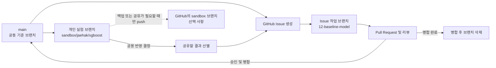
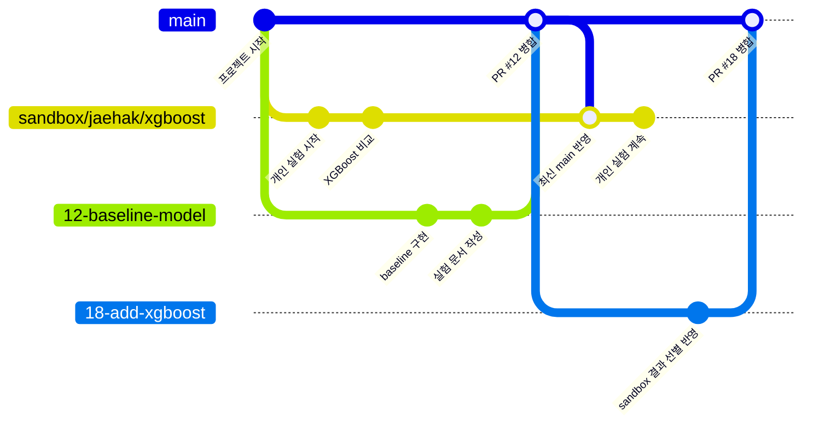

# 프로젝트 작업 규칙

이 문서는 `siemens_aoi` 프로젝트에 참여하는 사람과 에이전트가 함께 따르는 공통 규칙이다.

현재 프로젝트 목표는 `팀원과 회의 후 구체적 사항 기록 예정`이다. 이 프로젝트는 2일간의 빠른 실험을 위한 노트북 중심 구조로 진행한다.

## 작업 전 확인

작업을 시작하기 전에 다음 파일을 확인한다.

- `README.md`
- 작업 대상과 같은 유형의 example

데이터 또는 실험을 다룰 때는 다음 문서도 확인한다.

- `docs/data_example.md`
- `docs/experiments/index.md`
- `docs/model_val.md`

## Example 우선 원칙

- 모든 새 파일과 산출물은 저장소에 있는 동일 유형의 example을 먼저 확인하고 그 구조와 형식을 참고하여 생성한다.
- 노트북은 `notebooks/0823_example_001_baseline.ipynb`를 참고한다.
- 실험 문서는 `docs/experiments/0823_example_001_baseline.md`를 참고한다.
- 데이터 설명 문서는 `docs/data_example.md`를 참고한다.
- example의 합성 데이터, 결과값, 작성자명은 실제 산출물에 그대로 복사하지 않는다.
- 규칙이 변경되면 관련 문서와 example도 같은 변경에서 함께 갱신한다.

## 저장소 사용 범위

- `data/raw/`: 전달받은 원본 익명 데이터
- `notebooks/`: 탐색, 전처리, 학습 및 평가를 수행하는 노트북
- `models/`: 노트북 실행으로 생성된 모델 파일
- `docs/experiments/`: 노트북과 1:1로 대응하는 실험 설명 문서
- `docs/model_val.md`: 여러 실험에서 생성한 모델의 최종 Test 성능 비교표

별도 합의가 없다면 `src/`, `results/`, `data/processed/`를 추가하지 않는다.

## 파일 이름 규칙

실험 파일은 `MMDD_작성자_실험번호_설명` 형식으로 작성한다.

- 날짜는 월과 일을 각각 두 자리로 작성한다.
- 작성자는 영문 소문자로 작성한다.
- 실험 번호는 세 자리 숫자로 작성한다.
- 실험 번호는 날짜가 바뀌어도 작성자별로 계속 증가시킨다.
- 설명은 짧은 영문 소문자와 밑줄을 사용한다.
- 대응하는 노트북, 실험 문서, 모델은 동일한 파일명 본문(stem)을 사용한다.

예시:

- `notebooks/0823_jaehak_002_baseline.ipynb`
- `docs/experiments/0823_jaehak_002_baseline.md`
- `models/0823_jaehak_002_baseline.pkl`

`example` 작성자명은 example 파일에서만 사용한다. 작성 형식이나 구조를 보여주기 위한 파일은 파일 이름에 `example`을 포함한다.

## 데이터 규칙

- `data/raw/`의 원본 파일을 수정하거나 덮어쓰지 않는다.
- 원본 데이터와 생성된 모델 파일을 Git에 커밋하지 않는다.
- 익명 데이터도 민감할 수 있다고 간주한다.
- 실제 데이터 행이나 고유값을 문서와 출력에 불필요하게 노출하지 않는다.
- 전처리는 기본적으로 노트북 실행 시 수행한다.
- 학습 데이터에서 추정해야 하는 전처리는 데이터 분할 후 학습 데이터에만 `fit`한다.
- 실제 데이터 구조를 기록할 때는 `docs/data_example.md`를 참고해 별도 문서를 작성한다.

## 노트북 규칙

- 탐색, 전처리, 학습 및 평가는 우선 노트북에서 진행한다.
- 노트북은 위에서 아래로 순서대로 실행 가능하게 작성한다.
- 데이터 분리와 모델 학습에 고정된 랜덤 시드를 사용한다. 별도 합의 전 기본값은 `42`다.
- 마지막 부분에 주요 평가 지표, 해석, 다음 실험 제안을 기록한다.
- 최종 커밋 전 커널을 재시작하고 전체 셀을 순서대로 실행한다.
- 공통 로직이 안정되거나 운영 단계로 전환하기 전에는 성급하게 `src/`로 분리하지 않는다.

## 실험 문서 규칙

`notebooks/`에 추가하는 모든 실험 노트북은 `docs/experiments/`에 동일한 stem의 Markdown 문서를 가져야 한다.

실험 문서에는 다음 내용을 기록한다.

- 연결된 노트북 경로
- 상태
- 실험 목적
- 이전 실험 대비 주요 변경사항
- 평가 방법과 주요 결과
- 결론과 다음 단계
- 저장된 모델 경로(있는 경우)

노트북을 추가하거나 수정할 때 다음 작업을 함께 수행한다.

1. 대응하는 실험 문서를 추가하거나 갱신한다.
2. `docs/experiments/index.md`의 실험 목록을 갱신한다.
3. 모델의 최종 Test 평가가 있으면 `docs/model_val.md`에 결과를 추가하거나 갱신한다.
4. 실험 문서와 모델 평가표의 수치가 노트북의 최종 출력과 일치하는지 확인한다.
5. 재현할 수 없는 결과를 문서에 기록하지 않는다.

### 시도 로그 (2026-08-24 확정)

한 실험 노트북 안에서 여러 변형(불균형 처리 기법, feature 조합, 모델 구조 등)을
비교해보는 경우, 시도마다 별도 stem을 새로 만들지 않아도 된다. 대신 해당 실험
문서(`docs/experiments/<stem>.md`)에 "시도 로그" 표를 추가해 각 시도를 한 행씩
기록한다.

| 시도 | 변경 내용 | Slip Rate | Volume Reduction | 총비용(1:10 / 1:100) | 채택 |
|---|---|---:|---:|---|---|

- 채택하지 않은 시도도 지우지 않고 남긴다(무엇을 시도해서 왜 버렸는지가 정보다).
- 최종 채택한 시도만 노트북 결론과 `docs/model_val.md`에 반영한다.
- 총비용은 `docs/lsw/project/scope_and_roadmap.md`에 정한 두 비율(1:10, 1:100)
  시나리오를 함께 기록한다.

## 모델 평가 목록 규칙

`docs/model_val.md`는 여러 노트북에서 생성한 모델을 비교하는 단일 요약 문서다.

- Validation이 아니라 학습과 모델 선택에 사용하지 않은 Test 결과만 기록한다.
- 한 행은 하나의 `실험 + 모델 + threshold` 결과를 나타낸다.
- 같은 모델이라도 threshold 또는 Test 구간이 다르면 별도 행으로 기록한다.
- Test 기간, 연결된 실험 문서와 노트북 경로를 반드시 함께 기록한다.
- `class=1`을 Real Defect positive class로 사용한다.
- `PR-AUC`는 예측확률로 계산한 Average Precision을 기록한다.
- `Real Defect Recall`은 `TP / (TP + FN)`으로 계산한다.
- `False Call Reduction`은 `TN / (TN + FP)`으로 계산한다.
- 표에는 비교용 반올림 값을 기록하고 정확한 값과 confusion matrix는 개별 실험 문서에 남긴다.
- 서로 다른 Test 구간이나 데이터 처리 조건에서 얻은 결과를 조건 확인 없이 직접 비교하지 않는다.

## GitHub 협업 규칙

- 새 작업은 가능한 한 GitHub Issue로 먼저 기록하고 `.github/ISSUE_TEMPLATE/task.yml` 양식을 사용한다.
- Issue에는 작업 목적, 할 일, 완료 조건을 명확하게 기록한다.
- Pull Request는 `.github/pull_request_template.md` 양식을 유지하여 작성한다.
- 관련 Issue가 있다면 Pull Request에 `Closes #이슈번호` 형식으로 연결한다.
- 양식에서 해당하지 않는 항목은 삭제하지 않고 `해당 없음`으로 표시한다.
- 실험 노트북을 변경한 Pull Request에는 대응하는 실험 문서와 `docs/experiments/index.md` 변경도 포함한다.
- 모델의 최종 Test 결과가 있는 경우 `docs/model_val.md` 변경도 포함한다.
- 원본 데이터, 모델 바이너리 또는 비밀정보를 Issue나 Pull Request에 첨부하지 않는다.

## 브랜치 규칙

### 공용 작업 브랜치

- `main`은 검토가 끝난 공동 결과를 보관하는 기준 브랜치다.
- `main`에 직접 커밋하지 않고 Issue별 작업 브랜치에서 Pull Request를 생성한다.
- 브랜치 이름은 `<issue-number>-<short-name>` 형식으로 작성한다.
- 이슈 번호는 숫자로, 설명은 짧은 영문 소문자와 하이픈으로 작성한다.
- 작업 브랜치는 최신 `main`에서 생성하며 하나의 브랜치에서는 하나의 Issue만 다룬다.
- 작업 브랜치는 GitHub에 push하고 Pull Request의 대상 브랜치를 `main`으로 지정한다.
- Pull Request가 병합되면 해당 작업 브랜치는 삭제한다.

예시:

```text
12-baseline-model
15-fix-data-split
```

### 개인 실험 브랜치

- 개인 실험은 `sandbox/<member>/<topic>` 형식의 브랜치에서 진행한다.
- 팀원 이름만 붙인 하나의 브랜치를 장기간 사용하지 않고 실험 주제별로 브랜치를 구분한다.
- 개인 실험 브랜치는 로컬 사용을 원칙으로 한다.
- 다른 기기에서의 작업, 백업 또는 팀원과의 중간 결과 공유가 필요한 경우에만 GitHub에 push한다.
- 개인 실험 브랜치는 `main`으로 직접 Pull Request를 만들거나 병합하지 않는다.
- 개인 실험을 공용 결과로 반영하려면 먼저 Issue를 생성한다. 이후 최신 `main`에서 Issue 작업 브랜치를 만들고 필요한 변경만 옮겨 Pull Request를 생성한다.
- 새 실험을 시작하기 전에는 최신 `main`을 기준으로 브랜치를 생성한다.

예시:

```text
sandbox/jaehak/xgboost
sandbox/minji/feature-selection
```

### 브랜치 흐름



#### Git graph 예시



## 커밋 규칙

커밋 메시지는 다음 형식으로 작성한다.

```text
<type>: <변경 내용>
```

사용 가능한 타입은 다음과 같다.

| 타입 | 용도 |
|---|---|
| `exp` | 노트북 실험, 모델 비교, 평가 결과 |
| `data` | 데이터 로딩, 전처리, 스키마 관련 변경 |
| `feat` | 새로운 기능 추가 |
| `fix` | 오류 또는 잘못된 로직 수정 |
| `docs` | 문서 추가 및 변경 |
| `chore` | 의존성, GitHub 설정, 저장소 정리 |
| `refactor` | 동작 변경 없는 코드 구조 개선 |

예시:

```text
exp: baseline 모델 실험 추가
data: 익명 컬럼 타입 설명 갱신
fix: 검증 데이터의 전처리 누수 수정
docs: 실험 문서 작성 규칙 정리
chore: GitHub 이슈와 PR 양식 추가
```

세부 규칙은 다음과 같다.

- 타입은 영문 소문자로 작성한다.
- 변경 내용은 한국어로 작성할 수 있다.
- 제목 끝에 마침표를 붙이지 않는다.
- 제목은 가능하면 50자 이내로 작성한다.
- `수정`, `업데이트`, `최종`처럼 변경 내용을 알 수 없는 표현만 사용하지 않는다.
- 하나의 커밋에는 하나의 논리적 변경만 포함한다.
- 노트북, 대응 실험 문서, 실험 인덱스, 모델 평가표처럼 함께 바뀌어야 하는 파일은 하나의 논리적 변경으로 취급한다.
- 추가 설명이 필요하면 제목 다음에 빈 줄을 두고 변경 이유와 주의사항을 작성한다.
- 원본 데이터와 모델 바이너리는 커밋하지 않는다.
- Pull Request는 가능하면 squash merge하고, 최종 커밋 메시지도 같은 형식을 사용한다.

본문을 포함하는 예시:

```text
fix: 검증 데이터의 전처리 누수 수정

데이터 분할 전에 수행하던 스케일링을 Pipeline 내부로 이동했다.
학습 데이터에만 전처리기가 fit되도록 변경했다.
```

## 의존성과 보안

- 새로운 Python 패키지를 사용하면 `requirements.txt`를 함께 갱신한다.
- 비밀번호, 토큰, API 키를 저장소에 기록하지 않는다.
- 데이터 또는 모델 바이너리를 추적하기 위해 `.gitignore` 예외를 임의로 추가하지 않는다.

## 완료 전 확인

- 변경한 파일이 같은 유형의 example 및 현재 규칙과 일치하는지 확인한다.
- 변경한 노트북을 처음부터 끝까지 실행한다.
- 노트북과 실험 문서가 1:1로 대응하는지 확인한다.
- 노트북 결과와 실험 문서의 지표가 일치하는지 확인한다.
- 모델의 최종 Test 결과가 있으면 `docs/model_val.md`와 노트북의 지표가 일치하는지 확인한다.
- 실제 데이터와 모델 바이너리가 Git 변경사항에 포함되지 않았는지 확인한다.
